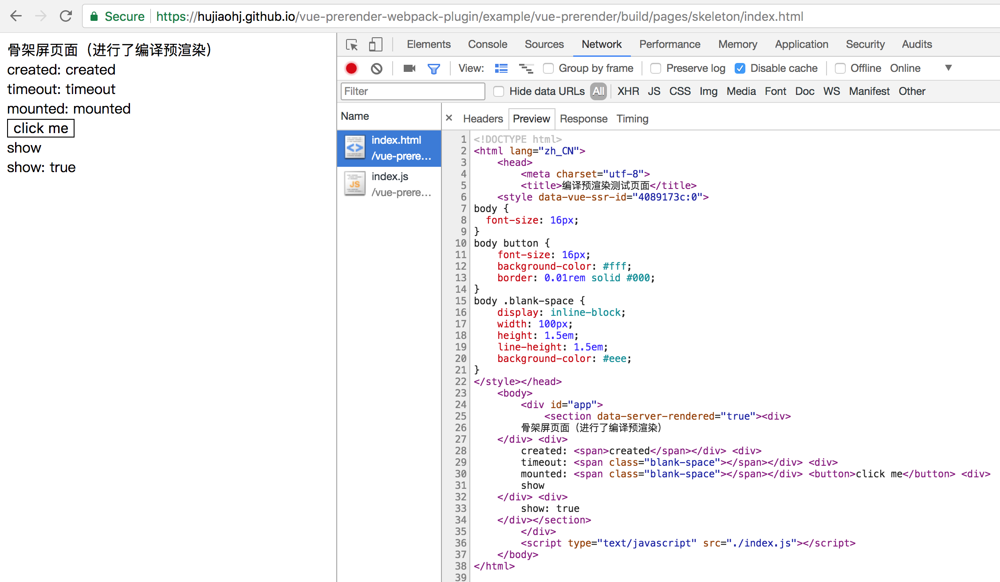
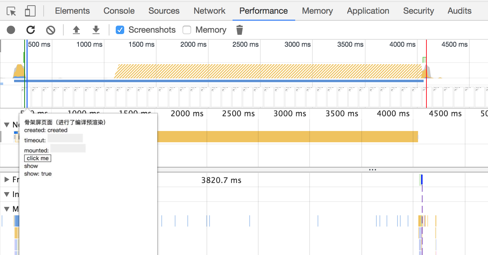
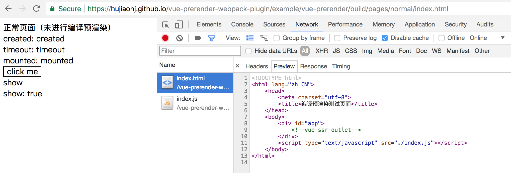
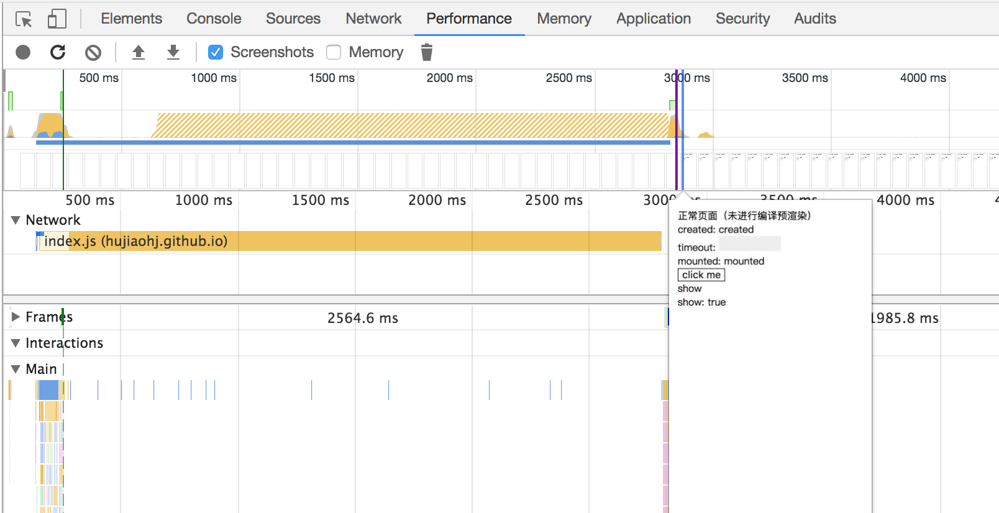
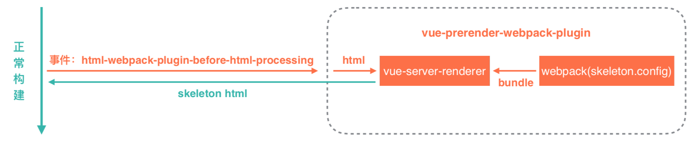

# vue-prerender-webpack-plugin

[](https://badge.fury.io/js/vue-prerender-webpack-plugin)

[](https://nodei.co/npm/vue-prerender-webpack-plugin/)

利用Vue的SSR实现编译预渲染webpack插件，在编译过程中生成页面骨架屏，提高页面性能和体验，提高首屏

## 使用

#### 安装

```
npm install vue-prerender-webpack-plugin
```

#### 在webpack配置中使用插件

```
const VuePrerenderWebpackPlugin = require('vue-prerender-webpack-plugin');
const skeleton = require('./skeleton'); // vue服务端渲染的webpack配置
 
module.exports = {
    ...
    plugins: [
        ...
        new VuePrerenderWebpackPlugin({
            config: skeleton,
        }),
        ...
    ],
    ...
}
```

在使用编译预渲染插件`vue-prerender-webpack-plugin`需要传入vue服务端渲染的webpack配置，可以参考 [Vue.js Server-Side Rendering Guide](https://ssr.vuejs.org/en/)

具体webpack配置参考 example 中 [skeleton](./blob/master/example/vue-prerender/webpack/skeleton.js) 中的配置

#### 页面结构

预渲染插件中使用了Vue的SSR，所以页面结构应该按照[SSR源码结构](https://ssr.vuejs.org/zh/structure.html)，如下：

##### app.js

```
import Vue from 'vue';
import App from './index.vue';

const app =  new Vue({
    components: {
        App
    },
    template: '<app />',
});

export default app;
```

##### index-normal.js

```
import app from './app';

app.$mount('#app');

export default app;
```

##### index-skeleton.js

```
import app from './app';

export default app;
```

##### index.html

```
<div id="app">
    <!--vue-ssr-outlet-->
</div>
```

## 实例

[example](./tree/master/example) 

## 效果

#### 预渲染页面

[链接](https://hujiaohj.github.io/vue-prerender-webpack-plugin/example/vue-prerender/build/pages/skeleton/index.html)

截图：





#### 正常页面

[链接](https://hujiaohj.github.io/vue-prerender-webpack-plugin/example/vue-prerender/build/pages/normal/index.html)

截图：





1、首屏时间：正常构建页面需要js执行完之后渲染首屏（3000ms），而预渲染构建在HTML加载完的时候就渲染首屏了（500ms）

2、编译预渲染会在编译过程中将组件空状态编译到HTML中，能一定程度上减少初次渲染的 DOM 节点数以节省 Virtual DOM 的初始化开销

## 实现



## 注意

该插件依赖`html-webpack-plugin`插件